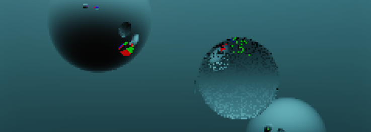

# Luau Ray Tracer

Open-source path tracing module with user-defined shader support on Roblox.

### [Documentation](https://tenx29.github.io/luau-ray-tracer/)

* [Getting Started](https://tenx29.github.io/luau-ray-tracer/getting-started/installation/)
* [API reference](https://tenx29.github.io/luau-ray-tracer/api-reference/render-pipeline/)

 

**Not for real-time use!**