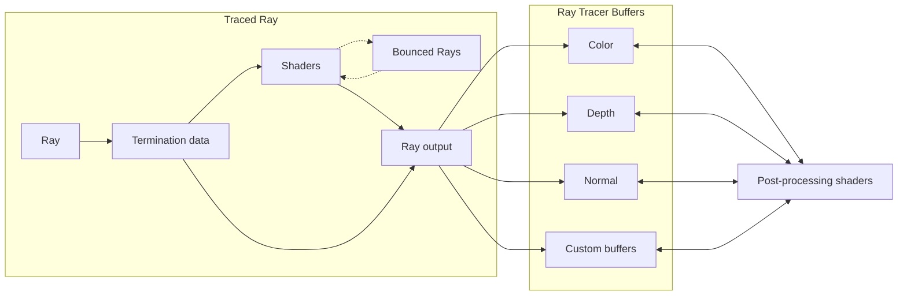

# Render pipeline

Luau Ray Tracer uses a relatively simple path tracer to render images. The path tracer is implemented as a recursive function that traces rays from the camera to the scene. Ray bounces are created using user-defined shader objects.

