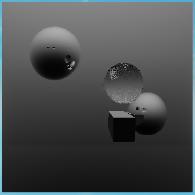
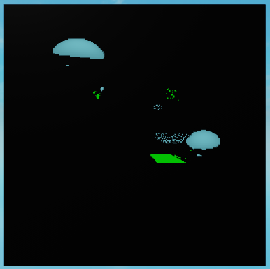
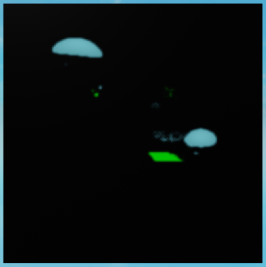
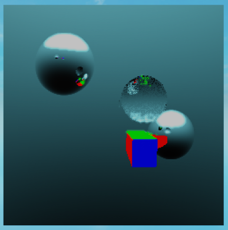

<style>
    .center {
        display: block;
        margin-left: auto;
        margin-right: auto;
        width: 50%;
    }
</style>

# Advanced post-processing

Here are some post-processing techniques that were not covered in the previous tutorials.

<br>

## Creating new buffers

Creating new buffers can be useful in cases where you want to pass additional information to other post-processing shaders that isn't originally available in the image. For example, you might want to create a luminance buffer from the original image in order to add a bloom effect.

??? abstract "Luminance shader example"
    ```lua linenums="1"
    local PostProcessingShader = require(script.Parent.Parent.classes.PostProcessingShader)

    local Luma = PostProcessingShader.new()

    Luma.Function = function(RayTracer, ...)
        local thresholdBuffer = RayTracer.Buffers.Color
        local depthBuffer = RayTracer.Buffers.Depth
        local normalBuffer = RayTracer.Buffers.Normal
        local lumaBuffer = {}
        for x = 1, #thresholdBuffer do
            lumaBuffer[x] = {}
            for y = 1, #thresholdBuffer[x] do
                -- This is the luminance formula based on the ITU-R BT.709 standard.
                local luma = 0.2126 * thresholdBuffer[x][y].r + 0.7152 * thresholdBuffer[x][y].g + 0.0722 * thresholdBuffer[x][y].b
                lumaBuffer[x][y] = luma
            end
        end

        -- Add the new Luma buffer to the RayTracer.
        return {
            Color = thresholdBuffer,
            Depth = depthBuffer,
            Normal = normalBuffer,
            Luma = lumaBuffer,
        }
    end

    return Luma
    ```
    <br>
    <figure class="center">
        
        <figcaption>Image of the Luma buffer after the post-processing shader is applied using the same scene as in the [Advanced shading](advanced-shading.md) tutorial.</figcaption>
    </figure>

<br>

## Using custom buffers in post-processing shaders

If a post-processing shader returns a buffer dictionary, the RayTracer will use the new buffers in place of the old ones. This is the easiest way to pass additional information to other post-processing shaders.

Expanding on the previous example, bloom effects typically find bright areas in the image by looking at the luminance buffer. Let's create a shader that creates a new buffer that only contains the bright areas in the image.

??? abstract "Brightness threshold shader example"
    ```lua linenums="1"
    local PostProcessingShader = require(script.Parent.Parent.classes.PostProcessingShader)

    local Threshold = PostProcessingShader.new()

    local minLuma = 0.7

    Threshold.Function = function(RayTracer, ...)
        local thresholdBuffer = RayTracer.Buffers.Color
        local depthBuffer = RayTracer.Buffers.Depth
        local normalBuffer = RayTracer.Buffers.Normal
        local lumaBuffer = RayTracer.Buffers.Luma
        local thresholdBuffer = {}
        for x = 1, #thresholdBuffer do
            thresholdBuffer[x] = {}
            for y = 1, #thresholdBuffer[x] do
                -- If the luminance is greater than the threshold, set the pixel to its original color.
                -- Otherwise, set it to black.
                if lumaBuffer[x][y] > minLuma then
                    thresholdBuffer[x][y] = thresholdBuffer[x][y]
                else
                    thresholdBuffer[x][y] = Color3.new(0, 0, 0)
                end
            end
        end

        -- Add the new Threshold buffer to the RayTracer.
        return {
            Color = thresholdBuffer,
            Depth = depthBuffer,
            Normal = normalBuffer,
            Luma = lumaBuffer,
            Threshold = thresholdBuffer,
        }
    end

    return Threshold
    ```
    <br>
    <figure class="center">
        
        <figcaption>Image of the Threshold buffer after the Threshold post-processing shader is applied.</figcaption>
    </figure>

<br>

Let's create a new post-processing shader that applies a Gaussian blur to the threshold buffer. The Gaussian blur is a convolution filter that blurs the image. We will include the radius of the blur as a variable in the shader.

??? abstract "Blurred brightness threshold example"
    ```lua linenums="1"
    local PostProcessingShader = require(script.Parent.Parent.classes.PostProcessingShader)

    local ThresholdBlur = PostProcessingShader.new()

    local radius = 2

    function getAverageColor3Cirle(img, x, y, radius)
        local sum = Vector3.new(0, 0, 0)
        local count = 0
        for i = -radius, radius do
            for j = -radius, radius do
                local x = x + i
                local y = y + j
                if x < 1 or x > #img or y < 1 or y > #img[x] then
                    continue
                end
                
                -- If the current pixel is outside the circle, skip it.
                if math.sqrt(i^2 + j^2) > radius then
                    continue
                end

                local color = Vector3.new(img[x][y].R, img[x][y].G, img[x][y].B)
                sum = sum + color
                count += 1
            end
        end
        return Color3.new(sum.X / count, sum.Y / count, sum.Z / count)
    end

    ThresholdBlur.Function = function(RayTracer, ...)
        local colorBuffer = RayTracer.Buffers.Color
        local depthBuffer = RayTracer.Buffers.Depth
        local normalBuffer = RayTracer.Buffers.Normal
        local lumaBuffer = RayTracer.Buffers.Luma
        local thresholdBuffer = RayTracer.Buffers.Threshold
        local blurredBuffer = {}
        for x = 1, #colorBuffer do
            blurredBuffer[x] = {}
            for y = 1, #colorBuffer[x] do
                local color = getAverageColor3Cirle(thresholdBuffer, x, y, radius)
                blurredBuffer[x][y] = color
            end
        end
        return {
            Color = colorBuffer,
            Depth = depthBuffer,
            Normal = normalBuffer,
            Luma = lumaBuffer,
            Threshold = thresholdBuffer,
            Blurred = blurredBuffer,
        }
    end

    return ThresholdBlur
    ```
    <br>
    <figure class="center">
        
        <figcaption>Image of the Blurred buffer after the ThresholdBlur post-processing shader is applied.

<br>

Finally, let's create a new post-processing shader that combines the blurred threshold buffer with the color buffer to create a bloom effect.

??? abstract "Bloom example"
    ```lua linenums="1"
    local PostProcessingShader = require(script.Parent.Parent.classes.PostProcessingShader)

    local Bloom = PostProcessingShader.new()
    Bloom.Function = function(RayTracer, ...)
        local colorBuffer = RayTracer.Buffers.Color
        local depthBuffer = RayTracer.Buffers.Depth
        local normalBuffer = RayTracer.Buffers.Normal
        local lumaBuffer = RayTracer.Buffers.Luma
        local thresholdBuffer = RayTracer.Buffers.Threshold
        local blurredBuffer = RayTracer.Buffers.Blurred
        local bloomBuffer = {}
        for x = 1, #colorBuffer do
            bloomBuffer[x] = {}
            for y = 1, #colorBuffer[x] do
                local color = Color3.new(
                    colorBuffer[x][y].R + blurredBuffer[x][y].R,
                    colorBuffer[x][y].G + blurredBuffer[x][y].G,
                    colorBuffer[x][y].B + blurredBuffer[x][y].B
                )
                bloomBuffer[x][y] = color
            end
        end
        return {
            Color = colorBuffer,
            Depth = depthBuffer,
            Normal = normalBuffer,
            Luma = lumaBuffer,
            Threshold = thresholdBuffer,
            Blurred = blurredBuffer,
            Bloom = bloomBuffer,
        }
    end
    return Bloom
    ```
    <br>
    <figure class="center">
        
        <figcaption>Image of the Bloom buffer after the Bloom post-processing shader is applied.</figcaption>
    </figure>

<br>

There we have it! Admittedly, this particular bloom effect doesn't look very good, but better-looking effects can be achieved by tweaking the shader parameters or by making the shader in a different way.

!!! note
    The bloom effect in this example is achieved using a combination of 4 post-processing shaders, but it is possible to achieve the same effect by combining the bloom effect with the threshold and blur post-processing shaders.
    
    You could also include the luma shader in the bloom shader, but keeping the luma shader separate may be useful for other post-processing effects.

<br>

!!! important
    When using custom buffers, make sure that each buffer is available when the post-processing shader is called. Post-processing shaders are called in the order that they are defined in the `RayTracer.PostProcessingShaders` table. In the previous example, the Threshold shader would be called after the Luma shader, so the RayTracer's PostProcessingShaders table would look like this:
    ```lua
    RayTracer.PostProcessingShaders = {Luma, Threshold}
    ```