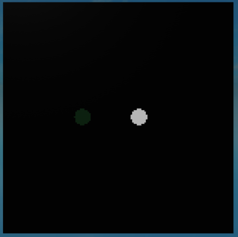
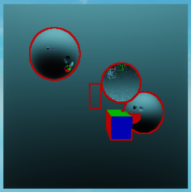

# Advanced shading

Here are some shading techniques that were not covered in the previous tutorials.

## Reflection

Reflection is the process of bouncing a ray off of a surface. The Shader class has a method called `Reflect` that can be used to create a reflection ray easily. Let's create a shader that reflects rays off of any objects with the name 'Mirror'.

??? info "Mirror shader example"
    ```lua linenums="1"
    -- ModuleScript

    local Shader = require(script.Parent.Parent.classes.Shader)

    local MirrorShader = Shader.new()

    MirrorShader.Function = function(Ray, Hit, ...)
        -- If the ray didn't hit anything, skip this shader.
        if not Hit then return end

        -- Only apply the shader to objects whose name is 'Mirror'.
        if Hit.Instance.Name == 'Mirror' then
            -- Get the normal of the surface that was hit.
            local Normal = Hit.Normal

            -- Create a reflection ray and return the color of the reflected ray.
            -- The Reflect method will copy all shaders from the original ray to the new ray
            -- and handles bounce limiting.
            Ray.Out.Color = Shader:Reflect(Ray, Hit, Normal).Color
            return Ray.Out
        end
    end

    return MirrorShader
    ```

<br>

## Refraction

Refraction is the process of bending a ray at the interface of two transparent objects. The Shader class has a method called `Refract` that can be used to create a refraction ray easily. Let's create a shader that refracts rays off of any objects with the name 'Glass'.

??? info "Glass shader example"
    ```lua linenums="1"
    -- ModuleScript

    local Shader = require(script.Parent.Parent.classes.Shader)

    local GlassShader = Shader.new()

    GlassShader.Function = function(Ray, Hit, ...)
        -- If the ray didn't hit anything, skip this shader.
        if not Hit then return end

        -- Only apply the shader to objects whose name is 'Glass'.
        if Hit.Instance.Name == 'Glass' then
            -- Get the normal of the surface that was hit.
            local Normal = Hit.Normal

            -- Create a refraction ray and return the color of the refracted ray.
            -- The Refract method will copy all shaders from the original ray to the new ray
            -- and handles bounce limiting.
            Ray.Out.Color = Shader:Refract(Ray, Hit, Normal, 1.5).Color
            return Ray.Out
        end
    end

    return GlassShader
    ```

<br>

## Custom buffer output

As a new feature in version 2, each TracedRay has an `Out` property that can be used to store custom data. This is useful if you want to create new buffers that are not part of the standard output.

To write custom data to the output, we must first create a new buffer before calling the Render method. This can be done by calling the `CreateBuffer` method on the RayTracer object.

<br>

Let's create a new buffer called `Neon` that uses black as a default value for each pixel.

```lua
myRayTracer:CreateBuffer('Neon', Color3.new(0, 0, 0))
```

<br>

Now let's write a create that writes the color of an object to the `Neon` buffer if the object's material is `Neon`.

??? info "Neon shader example"
    ```lua linenums="1"
    -- ModuleScript
    
    local Shader = require(script.Parent.Parent.classes.Shader)

    local NeonShader = Shader.new()

    NeonShader.Function = function(Ray, Hit, ...)
        -- If the ray didn't hit anything, skip this shader.
        if not Hit then return end
        -- Only apply the shader to objects whose material is Neon.
        if Hit.Material == Enum.Material.Neon then
            -- Write the color of the object to the Neon buffer.
            Ray.Out.Neon = Hit.Instance.Color
            return Ray.Out
        end
    end

    return NeonShader
    ```

<br>

Now let's apply this shader to the scene and see what the Neon buffer looks like.



Custom buffers such as this can be useful for certain types of post processing effects.

<br><br>

Here's another example of what you can do with the Shader and PostProcessingShader classes.



<br>

## Disclaimers

!!! important
    Remember to adjust your RayTracer `MaxBounces` setting to match the number of bounces you want.

!!! warning
    Some shaders may produce noisier results than others. Path tracing is very sensitive to noise, which becomes more noticeable as a ray bounces more times.