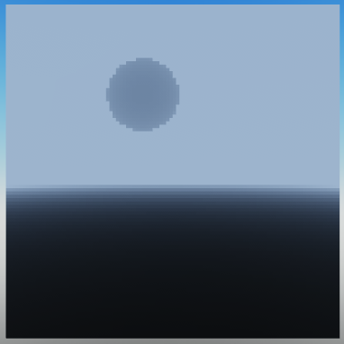
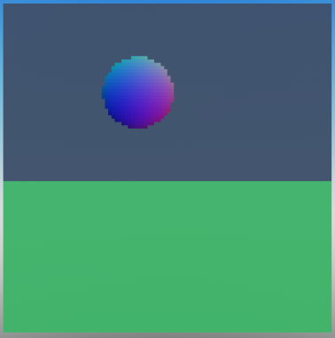

# Buffers

The Color, Depth and Normal buffers are used by the post-processing shaders to modify the output. The Color buffer gets its data from the shaders used in the path tracing step. The Depth and Normal buffers are generated based on the first hit of each ray, and therefore reflections and refractions are not taken into account.

Buffers can be modified by post-processing shaders, and even new buffers can be created by post-processing shaders if needed.

<br>

## Color Buffer
This buffer contains the color of every pixel in the scene. As a whole, it forms the image we've been drawing in previous tutorials.


<br>

## Depth Buffer
This buffer contains the depth of every pixel in the scene. The depth is the distance from the camera to the point where the ray hit the scene. Depth is measured as a percentage of the distance from the camera to the far plane, between 0 and 1.



!!! important
    Information in the depth buffer is stored as floating point values, not Color3. To render a pixel in the depth buffer as a color like in the above image, you must first convert the depth value to a color.
    ```lua
    local PixelDepth = myRayTracer.Buffers.Depth[x][y]
    local Color = Color3.new(PixelDepth, PixelDepth, PixelDepth)
    ```

<br>

## Normal Buffer
This buffer contains the normal of every pixel in the scene. The normal is the direction of the surface at the point where the ray hit the scene. The vectors are represented as Color3 values, where the r, g and b values are the x, y and z components of the normal vector respectively.



!!! important
    The color of a normal vector is calculated as follows:
    ```lua
    local normalColor = Color3.new((normal.X+1)/2, (normal.Y+1)/2, (normal.Z+1)/2)
    ```

    If a normal vector is a zero vector, its color is grey.