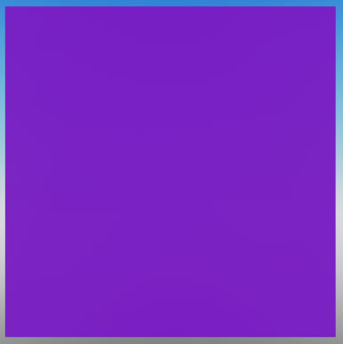

# Creating your first render

To get started, create a new RayTracingCamera to determine the camera position and orientation, as well as field of view and resolution.


```lua
-- We'll assume 'package' is the location of the Luau Ray Tracer package.
-- This will also be assumed in further examples.

local RayTracingCamera = require(package.classes.RayTracingCamera)

-- We'll use a resolution of 100x100 to avoid having to wait too long for the render to complete.
local resolution = Vector2(100, 100)
local fieldOfView = math.rad(70)    -- Field of view is measured in radians.
local farPlane = 100                -- How far the camera can see.

-- We'll place the camera 5 studs above the world origin.
-- Because we're not defining a direction, the camera will be looking down the -Z axis.
local CFrame = CFrame.new(Vector3.new(0,5,0))

-- Create the camera.
local myCamera = RayTracingCamera.new(resolution, fieldOfView, farPlane, CFrame)
```

<br>

Now we have the camera. However, the camera is not the one doing the rendering. It only tells the RayTracer where to look and which direction each pixel should be cast.

<br>

Let's create a RayTracer to do the rendering.

```lua
-- We'll require the RayTracer class at the top of the script.
local RayTracer = require(package.classes.RayTracer)

-- We won't be defining shaders just yet, so we don't need to pass any parameters except the camera.
-- Make sure you do this after you've created the camera.
local myRayTracer = RayTracer.new(myCamera)
```

<br>

Now we have both a camera and a RayTracer. Technically this is all we need to do to render a scene. Let's try it out by adding the following line to the end of our script:
```lua
local image = myRayTracer:Render()
```


??? abstract "Full script so far"
    ```lua linenums="1"
    local RayTracingCamera = require(package.classes.RayTracingCamera)
    local RayTracer = require(package.classes.RayTracer)

    -- We'll use a resolution of 100x100 to avoid having to wait too long for the render to complete.
    local resolution = Vector2(100, 100)
    local fieldOfView = math.rad(70)    -- Field of view is measured in radians.
    local farPlane = 100                -- How far the camera can see.

    -- We'll place the camera 5 studs above the world origin.
    -- Because we're not defining a direction, the camera will be looking down the -Z axis.
    local CFrame = CFrame.new(Vector3.new(0,5,0))

    -- Create the camera.
    local myCamera = RayTracingCamera.new(resolution, fieldOfView, farPlane, CFrame)

    -- We won't be defining shaders just yet, so we don't need to pass any parameters except the camera.
    local myRayTracer = RayTracer.new(myCamera)

    local image = myRayTracer:Render()
    ```

<br>

You now have your first ray traced render! However, you still can't see an image yet. This is because the RayTracer does not display the image; instead, it returns it as a table.

<br>

Let's create a function to display the image using parts.
```lua
function showImage(image)
    for x = 1, #image do
        for y = 1, #image[x] do
            local pixel = Instance.new("Part")
            pixel.Size = Vector3.new(1, 1, 0)
            pixel.Position = Vector3.new(x, resolution.Y-y, -resolution.X)-Vector3.new(resolution.X/2, resolution.Y/2, 0)
            pixel.Anchored = true
            pixel.CanCollide = false
            pixel.CanTouch = false
            pixel.CanQuery = false
            pixel.CastShadow = false
            pixel.Locked = true
            pixel.Color = image[x][y]
            pixel.Material = Enum.Material.SmoothPlastic
            pixel.Parent = workspace
        end
    end
end
```

<br>

And now we can call the function to display the image.

```lua
showImage(image)
```

??? abstract "Full script so far"
    ```lua linenums="1" hl_lines="21-40"
    local RayTracingCamera = require(package.classes.RayTracingCamera)
    local RayTracer = require(package.classes.RayTracer)

    -- We'll use a resolution of 100x100 to avoid having to wait too long for the render to complete.
    local resolution = Vector2.new(100, 100)
    local fieldOfView = math.rad(70)    -- Field of view is measured in radians.
    local farPlane = 100                -- How far the camera can see.

    -- We'll place the camera 5 studs above the world origin.
    -- Because we're not defining a direction, the camera will be looking down the -Z axis.
    local CFrame = CFrame.new(Vector3.new(0,5,0))

    -- Create the camera.
    local myCamera = RayTracingCamera.new(resolution, fieldOfView, farPlane, CFrame)

    -- We won't be defining shaders just yet, so we don't need to pass any parameters except the camera.
    local myRayTracer = RayTracer.new(myCamera)

    local image = myRayTracer:Render()

    function showImage(image)
        for x = 1, #image do
            for y = 1, #image[x] do
                local pixel = Instance.new("Part")
                pixel.Size = Vector3.new(1, 1, 0)
                pixel.Position = Vector3.new(x, resolution.Y-y, -resolution.X)-Vector3.new(resolution.X/2, resolution.Y/2, 0)
                pixel.Anchored = true
                pixel.CanCollide = false
                pixel.CanTouch = false
                pixel.CanQuery = false
                pixel.CastShadow = false
                pixel.Locked = true
                pixel.Color = image[x][y]
                pixel.Material = Enum.Material.SmoothPlastic
                pixel.Parent = workspace
            end
        end
    end

    showImage(image)
    ```

<br>



You can see a beautiful magenta square. But why is it magenta?

Magenta is the default color for a pixel that does not have any shading applied. This makes it easy to see which pixels are not being shaded, which is useful for debugging. But it's proably not the kind of image you wanted to see.

In order to actually see something, we need to define shaders for the RayTracer to use, so it knows what to do with each pixel. We'll start creating shaders in the next section.