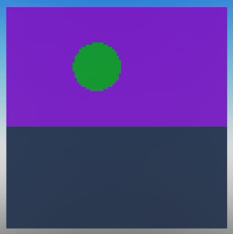

# Creating your first shader

Now that we have a camera and a RayTracer, we're ready to start defining shaders. If you skipped the previous section, here is the code we've written so far:
??? abstract "Full script so far"
    ```lua linenums="1"
    local RayTracingCamera = require(package.classes.RayTracingCamera)
    local RayTracer = require(package.classes.RayTracer)

    -- We'll use a resolution of 100x100 to avoid having to wait too long for the render to complete.
    local resolution = Vector2.new(100, 100)
    local fieldOfView = math.rad(70)    -- Field of view is measured in radians.
    local farPlane = 100                -- How far the camera can see.

    -- We'll place the camera 5 studs above the world origin.
    -- Because we're not defining a direction, the camera will be looking down the -Z axis.
    local CFrame = CFrame.new(Vector3.new(0,5,0))

    -- Create the camera.
    local myCamera = RayTracingCamera.new(resolution, fieldOfView, farPlane, CFrame)

    -- We won't be defining shaders just yet, so we don't need to pass any parameters except the camera.
    local myRayTracer = RayTracer.new(myCamera)

    local image = myRayTracer:Render()

    function showImage(image)
        for x = 1, #image do
            for y = 1, #image[x] do
                local pixel = Instance.new("Part")
                pixel.Size = Vector3.new(1, 1, 0)
                pixel.Position = Vector3.new(x, resolution.Y-y, -resolution.X)-Vector3.new(resolution.X/2, resolution.Y/2, 0)
                pixel.Anchored = true
                pixel.CanCollide = false
                pixel.CanTouch = false
                pixel.CanQuery = false
                pixel.CastShadow = true
                pixel.Locked = true
                pixel.Color = image[x][y]
                pixel.Material = Enum.Material.SmoothPlastic
                pixel.Parent = workspace
            end
        end
    end

    showImage(image)
    ```

<br>

## What is a shader?

If you already know what a shader is, you can skip to the next section. Otherwise, here is a quick explanation.

A shader is a set of instructions that define how a pixel should be colored based on several factors such as the position of the camera and the position of the object being rendered. Normally shaders run on the GPU, but since this is Roblox, we'll have to settle for running them on the CPU. This is not great for performance, as even a 640x480 image has a lot of pixels that need to be calculated, and a CPU only has a handful of cores unlike a GPU, which can have thousands of cores calculating the shaders for several pixels at a time.

<br>

## How do shaders work with the RayTracer?

Luau Ray Tracer is a library that allows you to define shaders in Lua. Luau shaders are defined as objects that inherit from the `Shader` class. Each shader has a function which determines how a pixel should be colored, and if more rays should be created to simulate phenomena like reflection and refraction.

When a TracedRay terminates for any reason (i.e. it hits an object or the far plane), the shader is called to determine the color of the pixel. If the shader returns a color, that color is used to color the pixel. If the shader returns `nil`, the pixel will keep its current color.

??? tip "Example Shader"
    Here's an example shader that makes every Part whose name is 'Mirror' to reflect the ray.
    ```lua
    -- ModuleScript
    local Shader = require(script.Parent.Parent.classes.Shader)

    local MirrorShader = Shader.new()

    MirrorShader.Function = function(Ray, Hit, ...)
        -- If the ray didn't hit anything, skip this shader.
        if not Hit then return end

        -- Only apply the shader to objects whose name is 'Mirror'.
        if Hit.Instance.Name == 'Mirror' then
            local Normal = Hit.Normal
            -- Create a reflection ray and return the color of the reflected ray.
            return Shader:Reflect(Ray, Hit, Normal).Color
        end
    end

    return MirrorShader
    ```
    This is still a very simple shader. More advanced shaders can be created with more complex logic.

<br>

## Creating a shader

Let's create a shader that displays the color of an object if a ray hits it. We'll define the shader in a separate ModuleScript. For simplicity, we'll create a new folder called `shaders` in the package folder. We'll then create a ModuleScript called `TestShader` in the `shaders` folder.

```lua
-- ModuleScript

-- We'll begin by including the Shader class.
-- Since the ModuleScript is in package.Shaders, we can use a relative path to the Shader class.
local Shader = require(script.Parent.Parent.classes.Shader)

-- Create a new shader.
local TestShader = Shader.new()

-- Define the function of the shader.
TestShader.Function = function(Ray, Hit, ...)
    -- If the ray didn't hit anything, skip this shader.
    if not Hit then return end
    -- Return the color of the object that was hit.
    return Hit.Instance.Color
end

-- Finally return the shader so we can use it.
return TestShader
```

<br>

Now we'll also need to require the shader in our main script. We'll do this at the top of our script.

```lua
local TestShader = require(package.shaders.TestShader)
```

<br>

Next, let's apply the shader to our ray tracer. We'll have to replace the current Ray Tracer definition with our new one.

```lua
local myRayTracer = RayTracer.new(myCamera, 1, {TestShader})
```
Note that we're passing 3 arguments to the RayTracer now. The second argument is the maximum number of bounces that the ray can make before it's terminated. The third argument is an array of shaders to apply to the ray. In this case, we only have one shader, so we'll pass an array of length 1. Because our shader does not have reflections or refractions, 1 is enough for the maximum number of bounces.

??? abstract "Full script so far"
    ```lua linenums="1" hl_lines="3 18"
    local RayTracingCamera = require(package.classes.RayTracingCamera)
    local RayTracer = require(package.classes.RayTracer)
    local TestShader = require(package.shaders.TestShader)

    -- We'll use a resolution of 100x100 to avoid having to wait too long for the render to complete.
    local resolution = Vector2.new(100, 100)
    local fieldOfView = math.rad(70)    -- Field of view is measured in radians.
    local farPlane = 100                -- How far the camera can see.

    -- We'll place the camera 5 studs above the world origin.
    -- Because we're not defining a direction, the camera will be looking down the -Z axis.
    local CFrame = CFrame.new(Vector3.new(0,5,0))

    -- Create the camera.
    local myCamera = RayTracingCamera.new(resolution, fieldOfView, farPlane, CFrame)

    -- We won't be defining shaders just yet, so we don't need to pass any parameters except the camera.
    local myRayTracer = RayTracer.new(myCamera, 1, {TestShader})

    local image = myRayTracer:Render()

    function showImage(image)
        for x = 1, #image do
            for y = 1, #image[x] do
                local pixel = Instance.new("Part")
                pixel.Size = Vector3.new(1, 1, 0)
                pixel.Position = Vector3.new(x, resolution.Y-y, -resolution.X)-Vector3.new(resolution.X/2, resolution.Y/2, 0)
                pixel.Anchored = true
                pixel.CanCollide = false
                pixel.CanTouch = false
                pixel.CanQuery = false
                pixel.CastShadow = false
                pixel.Locked = true
                pixel.Color = image[x][y]
                pixel.Material = Enum.Material.SmoothPlastic
                pixel.Parent = workspace
            end
        end
    end

    showImage(image)
    ```

<br>

Let's see what our image looks like.



It would seem that the shader is working as expected. If we put a green sphere in the scene, the sphere should be green in the final render as well.

!!! tip
    Set the parts in your test scene to invisible so they don't block your view. Because we haven't defined a transparency shader, parts will be rendered as a solid color regardless of their transparency property.

There is one problem with this shader. If a ray doesn't hit anything, it will keep its current color. Because we haven't defined a shader for rays that terminate without hitting anything, the sky is displayed as magenta. We'll deal with this in the next section.