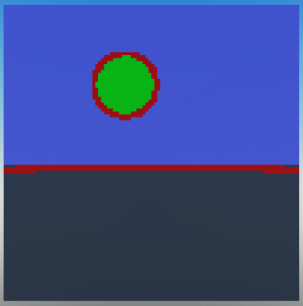
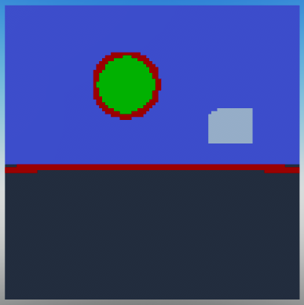
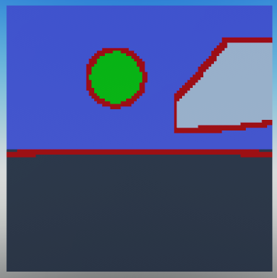

# Post-processing

Post-processing is the act of transforming the initially generated output into a final output. In this case this means modifying the Color, Depth and Normal buffers as needed after the path tracing step has completed. Post-processing is not required for the ray tracer to work, but can be useful for creating interesting effects.

!!! important
    The post-processing step only runs after the path tracing step has completed. This means that individual path data is not available to post-processing shaders. Unlike path shaders, post-processing shaders have access to all pixels in every buffer at once.

<br>

## Post-processing shaders

Post-processing shaders are shaders that are run after the path tracing step has completed. They are run on every pixel in the scene, and can modify the Color, Depth and Normal buffers.

<br>

## Creating a post-processing shader

Let's create a shader that detects edges in the image based the shapes of the objects in the scene. We will be using depth-based edge detection, which isn't the most accurate method, but is simple to implement.

It is recommended that you create a new folder in the Luau Ray Tracer package called `postprocessing` and put your post-processing shaders in there. For the purposes of this tutorial, we'll be assuming you do that.

<br>

Start by creating a new ModuleScript called `EdgeDetection` in the `postprocessing` folder.

```lua
-- ModuleScript

local PostProcessingShader = require(script.Parent.Parent.classes.PostProcessingShader)

local EdgeDetection = PostProcessingShader.new()
```

<br>

!!! info "How does depth-based edge detection work?"
    Depth-based edge detection works by comparing the depth of each pixel to the depths of the adjacent pixels. If the difference between the depths is greater than a threshold, the pixel is considered an edge.

<br>

Let's define the function of the shader.

```lua linenums="1"
-- Depth difference threshold to detect edges.
-- If the depth difference between a pixel and its adjacent pixel is greater than this threshold, the pixel is considered an edge.
local edgeThreshold = 0.2

EdgeDetection.Function = function(Raytracer, ...)
	-- Loop through every pixel in the image.
	for x = 1, Raytracer.Camera.Resolution.X do
		for y = 1, Raytracer.Camera.Resolution.Y do
			-- Get the depth of the current pixel.
			local CurrentDepth = Raytracer.Buffers.Depth[x][y]

			-- Collect all the adjacent pixels.
			-- The first argument is the pixel's position, the second is the size of the ray traced viewport.
			-- The third argument is the radius of the area to search for adjacent pixels.
			local AdjacentPixels = EdgeDetection:GetAdjacentPixels(Vector2.new(x, y), Raytracer.Camera.Resolution, 1)
			local AdjacentDepth = {}
			
			-- Get the depth value for each pixel position from the depth buffer
			for _, pixel in AdjacentPixels do
				table.insert(AdjacentDepth, Raytracer.Buffers.Depth[pixel.X][pixel.Y])
			end
			
			-- Sort the depths. We'll use this to find the minimum and maximum depths.
			table.sort(AdjacentDepth)
			-- Get the difference between the depths.
			local DepthDifference = math.abs(AdjacentDepth[1] - AdjacentDepth[#AdjacentDepth])
			-- If the difference is greater than a threshold, the pixel is an edge.
			if DepthDifference > edgeThreshold then
				-- Edges will be highlighted in red in the image.
				-- Note that SetPixel sets the color of the pixel, not the depth.
				Raytracer:SetPixel(x, y, Color3.new(1, 0, 0))
			end
		end
	end

	-- Since we don't need to generate any more buffers, we can return the Ray Tracer's buffers in their current state.
	-- This has the same result as returning nil.
	return Raytracer.Buffers
end

return EdgeDetection
```

<br>

??? abstract "The full EdgeDetection shader"
    ```lua linenums="1"
    -- ModuleScript

    local PostProcessingShader = require(script.Parent.Parent.classes.PostProcessingShader)

    local EdgeDetection = PostProcessingShader.new()

    -- Depth difference threshold to detect edges.
    -- If the depth difference between a pixel and its adjacent pixel is greater than this threshold, the pixel is considered an edge.
    local edgeThreshold = 0.2

    EdgeDetection.Function = function(Raytracer, ...)
        -- Loop through every pixel in the image.
        for x = 1, Raytracer.Camera.Resolution.X do
            for y = 1, Raytracer.Camera.Resolution.Y do
                -- Get the depth of the current pixel.
                local CurrentDepth = Raytracer.Buffers.Depth[x][y]

                -- Collect all the adjacent pixels.
                -- The first argument is the pixel's position, the second is the size of the ray traced viewport.
                -- The third argument is the radius of the area to search for adjacent pixels.
                local AdjacentPixels = EdgeDetection:GetAdjacentPixels(Vector2.new(x, y), Raytracer.Camera.Resolution, 1)
                local AdjacentDepth = {}
                
                -- Get the depth value for each pixel position from the depth buffer
                for _, pixel in AdjacentPixels do
                    table.insert(AdjacentDepth, Raytracer.Buffers.Depth[pixel.X][pixel.Y])
                end
                
                -- Sort the depths. We'll use this to find the minimum and maximum depths.
                table.sort(AdjacentDepth)
                -- Get the difference between the depths.
                local DepthDifference = math.abs(AdjacentDepth[1] - AdjacentDepth[#AdjacentDepth])
                -- If the difference is greater than a threshold, the pixel is an edge.
                if DepthDifference > edgeThreshold then
                    -- Edges will be highlighted in red in the image.
                    -- Note that SetPixel sets the color of the pixel, not the depth.
                    Raytracer:SetPixel(x, y, Color3.new(1, 0, 0))
                end
            end
        end

        -- Since we don't need to generate any more buffers, we can return the Ray Tracer's buffers in their current state.
        -- This has the same result as returning nil.
        return Raytracer.Buffers
    end

    return EdgeDetection
    ```

<br>

!!! important
    Note that the `Function` property of the shader is a function that takes the Ray Tracer as its first argument. This is passed automatically when calling `RayTracer:PostProcess()`. `...` is the rest of the arguments passed to the shader via the RayTracer:PostProcess method.

!!! important
    The shader function is responsible for selecting the appropriate pixels to modify. If you want to modify every pixel in the image, you can do so by looping through every pixel in the image, as seen in the code above.

!!! note
    The post-processing shaders are expected to return nothing or the Ray Tracer's buffers to be used for the next post-processing shader. If the shader returns `nil`, the Ray Tracer will continue to use its current buffers. Returning the buffers can be useful if you want to pass additional information to the next post-processing shader, as you can return more buffers than what the Ray Tracer has by default.

<br>

Now let's add the Edge Detection shader to our main script.

```lua
local EdgeDetection = require(package.postprocessing.EdgeDetection)
```

<br>

And replace the previous RayTracer with the following:

```lua
local myRayTracer = RayTracer.new(myCamera, 1, {SkyShader, TestShader}, {EdgeDetection})
```

Just like the other shaders, post-processing shaders are passed to the Ray Tracer in a table and executed in order.

<br>

If we try rendering our scene again, we'll notice that nothing has changed. This is because post-processing shaders are not automatically executed when rendering a scene.

To execute the post-processing shaders, we can call the `RayTracer:PostProcess()` method after the initial render:
```lua
local image = myRayTracer:Render()
myRayTracer:PostProcess()
```

??? abstract "The full script so far"
    ```lua linenums="1" hl_lines="5 20 23"
    local RayTracingCamera = require(package.classes.RayTracingCamera)
    local RayTracer = require(package.classes.RayTracer)
    local TestShader = require(package.shaders.TestShader)
    local SkyShader = require(package.shaders.SkyShader)
    local EdgeDetection = require(package.postprocessing.EdgeDetection)

    -- We'll use a resolution of 100x100 to avoid having to wait too long for the render to complete.
    local resolution = Vector2.new(100, 100)
    local fieldOfView = math.rad(70)    -- Field of view is measured in radians.
    local farPlane = 100                -- How far the camera can see.

    -- We'll place the camera 5 studs above the world origin.
    -- Because we're not defining a direction, the camera will be looking down the -Z axis.
    local CFrame = CFrame.new(Vector3.new(0,5,0))

    -- Create the camera.
    local myCamera = RayTracingCamera.new(resolution, fieldOfView, farPlane, CFrame)

    -- We won't be defining shaders just yet, so we don't need to pass any parameters except the camera.
    local myRayTracer = RayTracer.new(myCamera, 1, {SkyShader, TestShader}, {EdgeDetection})

    local image = myRayTracer:Render()
    myRayTracer:PostProcess()

    function showImage(image)
        for x = 1, #image do
            for y = 1, #image[x] do
                local pixel = Instance.new("Part")
                pixel.Size = Vector3.new(1, 1, 0)
                pixel.Position = Vector3.new(x, resolution.Y-y, -resolution.X)-Vector3.new(resolution.X/2, resolution.Y/2, 0)
                pixel.Anchored = true
                pixel.CanCollide = false
                pixel.CanTouch = false
                pixel.CanQuery = false
                pixel.CastShadow = false
                pixel.Locked = true
                pixel.Color = image[x][y]
                pixel.Material = Enum.Material.SmoothPlastic
                pixel.Parent = workspace
            end
        end
    end

    showImage(image)
    ```

<br>

Now let's try rendering our scene again.



That looks pretty good! Let's try adding some more parts to the scene.



Looks like the white block's edges are not detected. This is because in this particular example it's located close to the camera's far plane, resulting in the depth difference between the block and the camera to be too small for our shader to detect. In our shader we set 0.2 as the threshold, so an edge's minimum depth difference is 20% of the camera's far plane distance. In our main script we set the far plane to 100 studs, so the minimum depth difference is 0.2 * 100 = 20. Therefore, if the object is more than 80 studs away from the camera, it won't be detected as an edge.

Let's bring the block closer to the camera.

