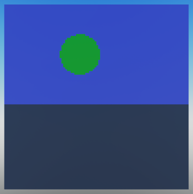

# Sky shaders

In the previous part we created a shader that displayed the color of an object if a ray hits it. If a ray didn't hit anything, no shader was applied, resulting in the sky appearing as magenta.

<br>

Let's create a shader that is only applied if a ray doesn't hit anything. Just like before, we'll define the shader in a ModuleScript located in the `shaders` folder.

```lua
-- ModuleScript
local Shader = require(script.Parent.Parent.classes.Shader)

local SkyShader = Shader.new()

-- Define the function of the shader.
SkyShader.Function = function(Ray, Hit, ...)
    -- If the ray hit something, skip this shader.
    if Hit then return end
    -- Let's return a solid light blue color to represent the sky.
    Ray.Out.Color = Color3.new(0.5, 0.5, 1)
    return Ray.Out
end

return SkyShader
```

<br>

Now let's add the sky shader to our ray tracer. First we'll have to require the shader in our main script.
```lua
local SkyShader = require(package.shaders.SkyShader)
```

<br>

Just like we did with the first shader, we'll replace the current Ray Tracer definition with our new one. This time we'll include both the sky shader and the first shader.
```lua
local myRayTracer = RayTracer.new(myCamera, 1, {SkyShader, TestShader})
```

??? abstract "Full script so far"
    ```lua linenums="1" hl_lines="4 20"
    local RayTracingCamera = require(package.classes.RayTracingCamera)
    local RayTracer = require(package.classes.RayTracer)
    local TestShader = require(package.shaders.TestShader)
    local SkyShader = require(package.shaders.SkyShader)

    -- We'll use a resolution of 100x100 to avoid having to wait too long for the render to complete.
    local resolution = Vector2.new(100, 100)
    local fieldOfView = math.rad(70)    -- Field of view is measured in radians.
    local nearPlane = 0.1              -- The near plane determines how close the camera can be to an object before it is clipped.
    local farPlane = 100                -- How far the camera can see.

    -- We'll place the camera 5 studs above the world origin.
    -- Because we're not defining a direction, the camera will be looking down the -Z axis.
    local CFrame = CFrame.new(Vector3.new(0,5,0))

    -- Create the camera.
    local myCamera = RayTracingCamera.new(resolution, fieldOfView, nearPlane, farPlane, CFrame)

    -- We won't be defining shaders just yet, so we don't need to pass any parameters except the camera.
    local myRayTracer = RayTracer.new(myCamera, 1, {SkyShader, TestShader})

    local image = myRayTracer:Render()

    function showImage(image)
        for x = 1, #image do
            for y = 1, #image[x] do
                local pixel = Instance.new("Part")
                pixel.Size = Vector3.new(1, 1, 0)
                pixel.Position = Vector3.new(x, resolution.Y-y, -resolution.X)-Vector3.new(resolution.X/2, resolution.Y/2, 0)
                pixel.Anchored = true
                pixel.CanCollide = false
                pixel.CanTouch = false
                pixel.CanQuery = false
                pixel.CastShadow = false
                pixel.Locked = true
                pixel.Color = image[x][y]
                pixel.Material = Enum.Material.SmoothPlastic
                pixel.Parent = workspace
            end
        end
    end

    showImage(image)
    ```

<br>

Let's see what the result looks like.



Finally the image is starting to look a little bit more what we expected.

!!! note
    For more advanced sky effects such as time of day, you can simply add the necessary code to the sky shader.